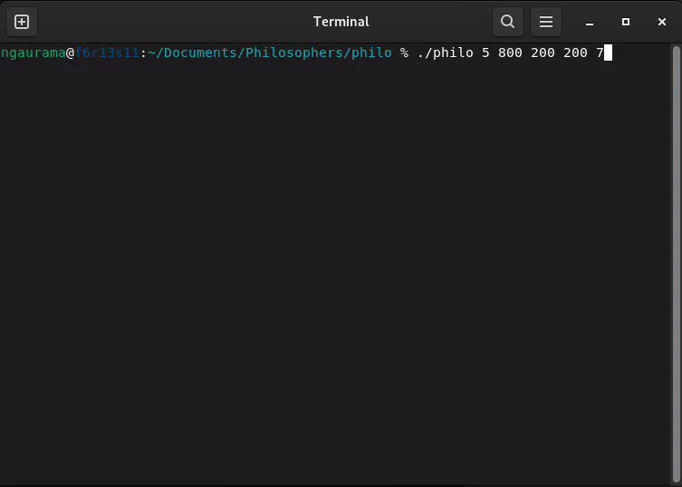

# philosophers

A multithreaded simulation of the Dining Philosophers problem, written in C as part of the 42 curriculum. This project demonstrates synchronization using threads and mutexes to prevent deadlocks and data races.

---

## The Dining Philosophers Problem
+ Overview
    + One or more philosophers sit at a round table with a large bowl of spaghetti in the center
    + Each philosopher alternates between eating, thinking, and sleeping
    + To eat, a philosopher must pick up both the fork to their left and the fork to their right
    + The simulation stops when a philosopher dies of starvation or all philosophers have eaten the required number of times

+ Rules & Constraints
    + Philosophers must avoid dying (starving)
    + No communication between philosophers
    + No global variables allowed
    + Must use threads and mutexes for synchronization
    + Strict timing requirements (death must be reported within 10ms)

---

## Project Structure

```
philo/
├── ansi_colors.h          # Terminal color definitions
├── design.c               # UI and presentation functions
├── inits.c                # Initialization functions
├── main.c                 # Main program entry point
├── Makefile               # Build configuration
├── monitor.c              # Monitoring thread implementation
├── philo.h                # Main header with all definitions
├── philo_utils.c          # Utility functions
├── simulation.c           # Philosopher behavior routines
├── start_and_clean.c      # Thread management and cleanup
└── utils.c                # Additional utils
```

---

## Installation

### Clone and build
```bash
git clone https://github.com/ngaurama/Philosophers.git
cd Philosophers/philo
make
```
This will generate the executable:

`philo`

### Usage
```
./philo number_of_philosophers time_to_die time_to_eat time_to_sleep [number_of_times_each_philosopher_must_eat]
```
+ Arguments
    + number_of_philosophers: Number of philosophers and forks
    + time_to_die (ms): Maximum time a philosopher can go without eating
    + time_to_eat (ms): Time it takes for a philosopher to eat
    + time_to_sleep (ms): Time a philosopher spends sleeping
    + number_of_times_each_philosopher_must_eat (optional): Simulation stops when all philosophers have eaten this many times
---

## Example:
+ Input:
    + `./philo 5 800 200 200 7`
+ Output:

    

---
## Algorithm & Implementation
### Core Architecture
+ Each philosopher is represented by a separate thread
+ Each fork is protected by a mutex
+ A monitor thread checks philosopher states to detect deaths or completion
+ Mutexes protect shared data to prevent race conditions

### Key Components
1. Initialization
    + Parse and validate input arguments
    + Initialize forks (mutexes) and philosopher structures
    + Set up synchronization primitives

2. Philosopher Routine
    + Thinking → Fork acquisition → Eating → Sleeping
    + Even-numbered philosophers pick up right fork first to prevent deadlocks
    + Odd-numbered philosophers pick up left fork first to improve concurrency

3. Monitoring System
    + Continuously checks each philosopher's last meal time
    + Detects when philosophers starve (time since last meal > time_to_die)
    + Tracks if all philosophers have eaten the required number of times

4. Precision Timing
    + Uses gettimeofday() for accurate timestamping
    + Implements a precise usleep function that checks simulation status

5. Thread-safe Logging
    + Protected by a mutex to prevent output interleaving
    + Color-coded output for better readability

### Deadlock Prevention
+ The implementation uses a strategy where philosophers pick up forks in different orders based on their ID (even vs odd), which prevents the circular wait condition that leads to deadlocks.
---

### Learning Outcomes

Through this project, I gained deep understanding of:
+ Multithreaded programming in C
+ Synchronization primitives (mutexes)
+ Deadlock prevention strategies
+ Resource management and cleanup
+ Precision timing in concurrent systems
+ Thread-safe output and logging
+ The Dining Philosophers problem and its solutions

---

### Evaluation


---
## Author
+ Nitai Gauramani
  - 42 Paris – Common Core project <br>


